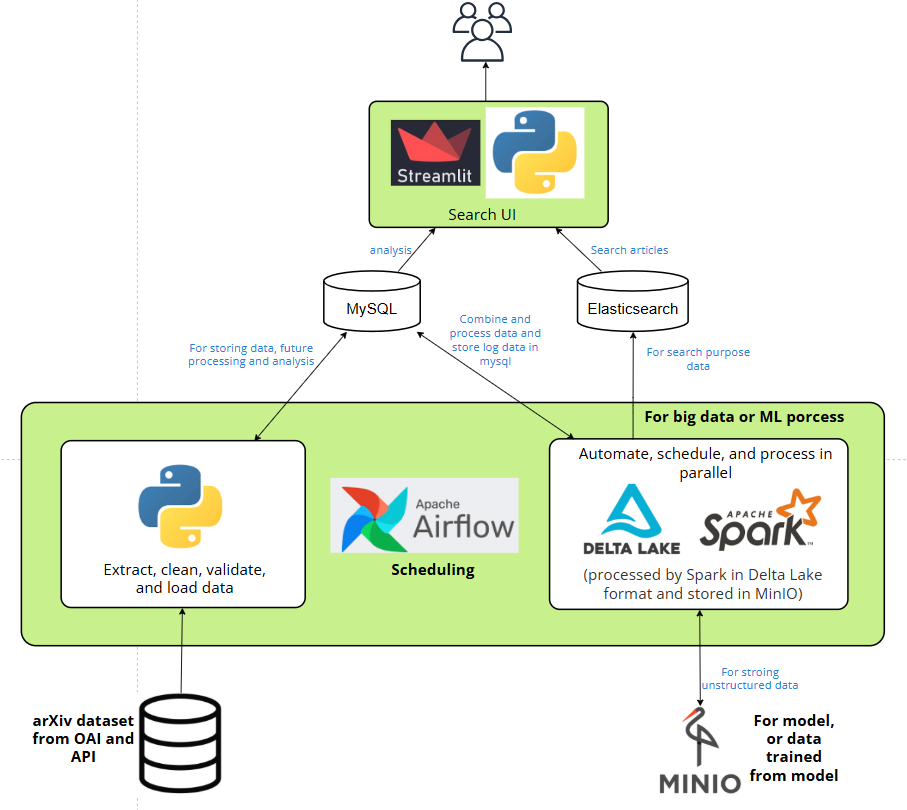
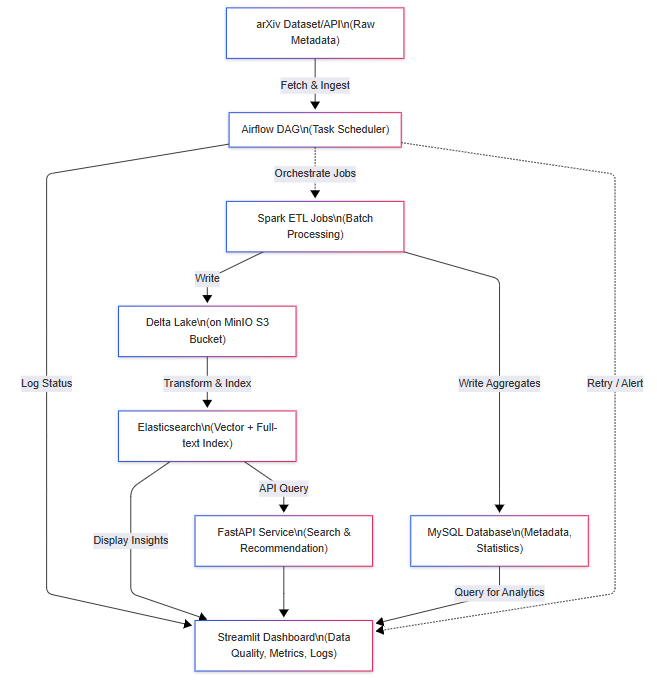

# arXiv Data Lakehouse & Search System

## 🧩 Project Summary
A complete end-to-end data pipeline built with **Spark**, **Kafka**, **Delta Lake**, **MinIO**, and **Elasticsearch**.  
It ingests and cleans arXiv metadata, performs clustering and vector embedding, and provides a **Streamlit interface** for semantic search, recommendations, and pipeline monitoring.

---

## 🏗️ System Architecture Overview
This project implements an end-to-end data pipeline for arXiv and some other companies' metadata processing, analytics, and search.

### 🗺️ High-Level Data Flow
The following diagram illustrates the overall flow of data from ingestion to the user interface.



### ⚙️ Logical Process Flow
The diagram below details how each component interacts and how data moves through the system.



**Layer Summary**
- Ingestion → ETL → Feature Engineering → Clustering → Elasticsearch → Streamlit + FastAPI  
- Bronze (MySQL) → Silver (Delta cleaned) → Gold (feature vectors) → Elasticsearch (vector index)

---

## 🧠 System Components
| Stage | Description |
|--------|--------------|
| **Ingestion** | Python scripts ingest data from the arXiv OAI/API and store it in MySQL (Bronze). |
| **Cleaning** | `task_silver_clean.py` — Spark ETL cleans, deduplicates, and joins data → Delta (Silver). |
| **Feature Engineering** | `task_build_features_gold.py` — TF-IDF feature generation → Delta (Gold). |
| **Clustering** | `task_data_clustering.py` — SVD + KMeans clustering → write vectors to Elasticsearch. |
| **Storage** | Delta Lake on MinIO for Silver/Gold layers. |
| **Search API** | FastAPI integrates with Elasticsearch for vector and keyword search. |
| **Frontend** | Streamlit UI for search, recommendations, and visualization. |
| **Monitoring** | MySQL + `ETL_metrics.py` for pipeline logs, status, and performance. |
| **Environment** | Dockerized (Airflow, Spark, MySQL, MinIO, Elasticsearch, Streamlit). |

---

## 🔄 ETL Flow Description
| Stage | Script | Description |
|--------|---------|-------------|
| **Bronze** | `etl_data_to_mysql_OAI.py`& `etl_data_to_mysql_api.py`| Pull raw XML → store in MySQL. |
| **Silver** | `task_silver_clean.py` | Clean, deduplicate, and join → Delta Lake. |
| **Gold** | `task_build_features_gold.py` | TF-IDF vectorization → Delta Lake. |
| **Clustering** | `task_data_clustering.py` | Dimensionality reduction (SVD) + KMeans → Elasticsearch. |
| **Monitoring** | `ETL_metrics.py` | Track ETL runs and visualize pipeline metadata. |
| **Analysis** | `etl_coauthorship_edges.py` | Basic visualizaion on data |
---

## 📊 Streamlit Dashboards

### 1. Search UI (`home.py`)
- Query arXiv data via FastAPI endpoints.  
- View results, clusters, and recommended papers.

### 2. Monitoring Dashboard (`ETL_metrics.py`)
- Latest run summary (records, duration, success rate).  
- Trend over time and stage breakdown.  
- Status bar charts and logs.

### 3. Academic Trends Dashboard (`arxiv_dashboard.py`)
- Average updates per discipline.  
- Median time to publication.  
- Cumulative submissions per author/institution.  
- Co-authorship network visualization.


<!-- - Co-authorship network visualization. -->

---

## 📈 Key Metrics
- **Pipeline metrics:** total records processed, duration, success rate.  
- **Data metrics:** unique papers, categories, authors.  
- **Search metrics:** total hits, latency, cluster coverage.

---

## ⚙️ Tech Stack
| Category | Tools |
|-----------|-------|
| Programming | Python 3.x |
| Orchestration | Apache Airflow |
| Data Processing | PySpark, Delta Lake |
| Database | MySQL |
| Object Storage | MinIO |
| Search Engine | Elasticsearch |
| Frontend | Streamlit + FastAPI |
| Visualization | Altair |
| Environment | Docker & Docker Compose |

> **Note:** `hadoop-aws-3.3.2.jar` is required specifically for Airflow to interact with MinIO/S3.

---

## 🚀 How to Run

1. **Clone the repository**
   ```bash
   git clone https://github.com/Mark-Din/arXiv_data_processing
   cd airflow
2. Start Airflow and PostgreSQL
    ```bash
    # You need to have Astronomer.Astro installed first
    astro dev start
    ```
3. Start other services
    ```bash
    docker-compose up --build
    ``` 
4. Access UIs
- MinIO: http://localhost:9001
- Spark: http://localhost:8080
- Streamlit: http://localhost:8501

## ☁️ Cloud Adaptability
| Local Component | AWS Equivalent |
|-----------|-------|
| MinIO | Amazon S3 |
| Spark | AWS Glue / EMR |
| Airflow | MWAA |
| Elasticsearch | OpenSearch |
| Streamlit | QuickSight / CloudWatch Dashboards|
| MySQL | DynamoDB / RDS |

## 🙏 Acknowledgments
### Datasets
- arXiv.org Open Access Metadata
- Kaggle arXiv Dataset

## 🧮 Institutional Rankings (Future Integration)
The architecture is designed to integrate external datasets such as journal impact factors, CORE conference rankings, and citation databases.
These enrichments can be ingested into the Bronze layer and joined with arXiv metadata in Silver/Gold layers to produce subject-wise institutional rankings.
This version focuses on core ETL, feature extraction, and semantic search, but is structured for future expansion.

## 📢 Further Note
The architecture was implemented fully on-premise using Docker and MinIO to ensure a self-contained, reproducible setup within the limited project timeline.
Each component mirrors a cloud equivalent (e.g., MinIO ↔ S3, Spark ↔ AWS Glue), allowing future migration to AWS with minimal refactoring.

## 🧭 Assumptions
- Each arXiv `paper_id` uniquely identifies a single paper across versions.
- Category mapping (`category_map`) is stable across all records.
- The pipeline runs daily and overwrites Silver/Gold layers for simplicity.
- On-premise setup (MinIO, Docker) simulates cloud-based architecture for demonstration.

## 🧩 Challenges & Irregularities
- **Inconsistent date formats:** The `updated` and `created` fields varied across OAI records, requiring normalization to standard ISO date strings.  
- **Missing abstracts or titles:** Some records lacked abstracts, which were dropped to maintain clean text input for TF-IDF.  
- **Duplicate records:** Multiple versions of the same paper required deduplication in the Silver layer using the latest `version_created`.  
- **Nested XML parsing:** OAI responses contained irregular XML tags that needed defensive parsing logic.
